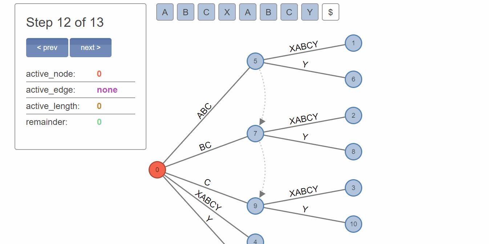
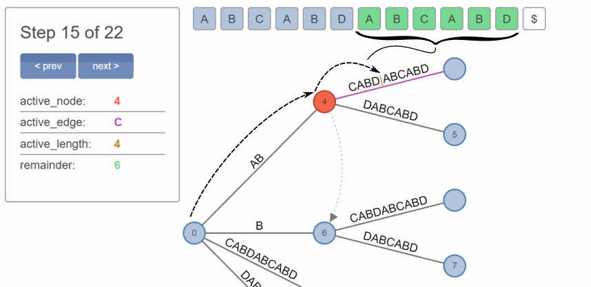
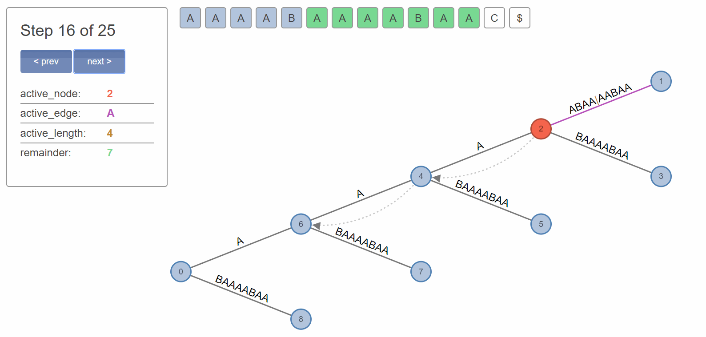
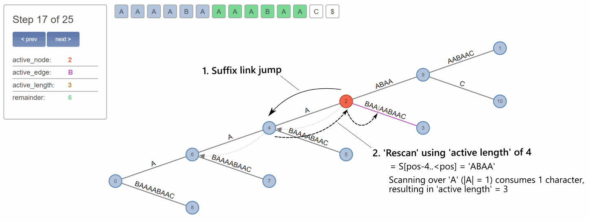
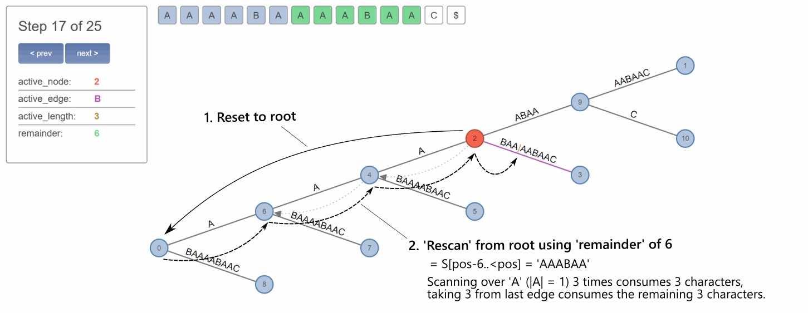

# Suffix Tree implementation in C# based on Ukkonen's linear time construction algorithm

[](https://travis-ci.com/baratgabor/SuffixTree)

If you're here you probably know what this is, so I won't waste your time by stating the obvious.

There is nothing revolutionary here. My assumption is that this repo – and especially the **[detailed description below](#plain-plain-english-explanation-of-ukkonens-algorithm)** – is mostly useful for people who are learning this algorithm the first time.

### Some implementation details

This implementation of Ukkonen's linear time suffix tree construction algorithm is based on my own observations. But later I realized how I approached the implementation corresponds quite well to how it's described by a [relatively recent paper by NJ Larsson et al.](https://arxiv.org/pdf/1403.0457.pdf), notably updating the active point mid-phase to decouple the leaf node insertion from the branching insertion.

This approach leads to a lean extension phase with little branching; in my case specifically the following:

```c#
private void ExtendTree(char c)
{
    _chars.Add(c);
    _needSuffixLink = null;
    _position++;
    _remainder++;

    while (_remainder > 0)
    {
        if (_AP.MoveDown(c))
            break;

        if (_AP.ActiveEdge != null)
            _AP.ActiveParent = InsertSplit(_AP);

        InsertLeaf(_AP, c);
        _remainder--;

        if (_remainder > 0)
            _AP.Rescan();
    }
}
```

*(As you can observe, I call the active node 'active parent'; it seemed to make more sense in my implementation.)*

Essentially everything boils down to the following fundamental operations:

- Move down in tree while possible, extending the edge. Aka. 'implicit' insertion cycle.
- When implicit fails, and there is an edge, split edge at Active Point, and activate the new branch node.
- Insert a new explicit leaf for the current input character at the active node.
- Rescan to set the Active Point to the correct next position.

### Storage

I used a central hashtable-based approach instead of per-node storage, which should improve the data locality and decrease the memory footprint of nodes, plus perform better with large alphabets than e.g. linked list based designs, but probably doesn't matter much. The hashing key I used is a value tuple that combines the node reference and the character ID of the edge (I store edge information in the nodes to cut down on implementation complexity and pointer dereferencing).

This hashtable/dictionary based storage was inspired by [Kurtz's paper](https://bioinformatics.cs.vt.edu/~easychair/multigenome_comparisons/Kurtz_SWPracticeandExperiment_1999.pdf), but for now I implemented it with reference type nodes.

Additionally, I converted my implementation to store suffix links externally as well, in another singular dictionary, which resulted in a very lean `Node` footprint. This is especially useful because I didn't employ a different representation for leaf nodes and branch nodes, so that link reference was taking up space in all node instances.

I'll probably continue to add features, and experiment with some different designs – if my time allows.

# Plain-plain English explanation of Ukkonen's algorithm

I'm using the 'plain-plain' prefix jokingly, because I actually struggled to follow the widely referenced [Plain English StackOverflow explanation](https://stackoverflow.com/questions/9452701/ukkonens-suffix-tree-algorithm-in-plain-english/9513423#9513423). While it's certainly a decent description, it took me days (and reading through several papers) to track down and understand the 'why' and 'how' parts of some key aspects of the algorithm.

In the sections below there is **ZERO mention of 'Rules' and 'Observations'** (who needs rules, we're all cowboys here ;)), and everything is 100% focused on actually explaining/understanding the underlying reasons. So I hope it will prove to be a refreshing read.

Keep in mind that I did not intend this to be a full explanation. While I did have to cover some fundamentals to create have a reasonable narrative, but I tried to focus on aspects I found to be vague in other sources. Thus, I think the most useful part of this text is the discussion of the [differences between rescanning and using suffix links](#differences-of-rescanning-vs-using-suffix-links). as this is what gave me a *lot* of headaches in my implementation.

*Please note that I'm not an expert on this subject, and the following sections may contain inaccuracies (or worse). If you encounter any, feel free to open an issue.*

## Prerequisites

This text assumes basic familiarity with the concept and rationale of *suffix trees*. This includes understanding the quadrating time complexity problem of their traditional naïve construction, what do they contain (the suffix structure and its representation as nodes and edges), and what are they generally used for.

## Basic rationale of Ukkonen's algorithm

[Ukkonen's algorithm](https://www.cs.helsinki.fi/u/ukkonen/SuffixT1withFigs.pdf) is used for creating a traditionally expensively built suffix tree in a computationally cheap way – in linear time, compared to the quadratic time complexity of the naïve construction algorithm.

This is essentially achieved by employing a few 'tricks', although if Ukkonen saw Arrested Development, he might insist these [aren't tricks, but illusions](https://www.youtube.com/watch?v=X1WSH0VzoaM) (apologies for the digression).

Additionally, the algorithm has 'on-line' property, which means we don't need to know the whole string in advance; the three can be built incrementally, character by character, from start to end.

The resulting tree structure is the same as if we built a suffix tree naively by decrementally adding all full suffixes of the string, e.g. *ABCD*, *BCD*, *BC* and *D* for the string *'ABCD'*.

## Open-ended leaf nodes and their limitations

The most fundamental and easy to understand 'trick' is to realize we can just leave the end of the suffixes 'open', i.e. referencing the current length of the string instead of setting the end to a static value. This way when we proceed to add additional characters, those characters will be implicitly added to all suffix labels, without having to visit and update all of them.

*It's worth noting, though, that you don't have to use an actual reference type for the open end position. For simplicity you can use a regular `int` and just designate a special value (e.g. -1) that marks the position open.*

But this open ending of suffixes works only for nodes which terminate the string, i.e. the leaf nodes in the tree structure. The branching operations we execute on the tree (the addition of new branch nodes and leaf nodes) won't propagate automatically everywhere they need to.

*It's probably elementary, and wouldn't require mention, that repeated substrings don't appear explicitly in the tree, since the tree already contains these by virtue of them being repetitions; however, when the repetitive substring ends by encountering a non-repeating character, we need to create a branching at that point to represent the divergence from that point onwards.*

For example in case of the string *'ABCXABCY'* (see below), a branching to *X* and *Y* needs to be added to three different suffixes, *ABC*, *BC* and *C*; otherwise it wouldn't be a valid suffix tree, and we couldn't find all substrings of the string by matching characters from the root downwards.

Once again, to emphasize – *any* operation we execute on a suffix in the tree needs to be reflected by its consecutive suffixes as well (e.g. ABC > BC > C), otherwise they simply cease to be valid suffixes.



But even if we accept that we have to do these manual updates, how do we know how many suffixes need to be updated? Since, when we add the repeated character *A* (and the rest of the repeated characters in succession), we have no idea yet when/where do we need to split the suffix into two branches. The need to split is ascertained only when we encounter the first non-repeating character, in this case *Y* (instead of the *X* that already exists in the tree).

What we can do is to match the longest repeated string we can, and count how many of its suffixes we need to update later. This is what *'remainder'* stands for.

## The concept of 'remainder' and 'rescanning'

The variable `remainder` tells us how many repeated characters we added implicitly, without branching; i.e. how many suffixes we need to visit to repeat the branching operation once we found the first non-repeating character. This essentially equals to how many characters 'deep' we are in the tree from its root.

So, staying with the previous example of the string *ABCXABCY*, we match the repeated *ABC* part 'implicitly', incrementing `remainder` each time, which results in remainder of 3. Then we encounter the non-repeating character *'Y'*. Here we split the previously added *ABCX* into *ABC*->*X* and *ABC*->*Y*. Then we decrement `remainder` from 3 to 2, because we already took care of the *ABC* branching. Now we repeat the operation by matching the last 2 characters – *BC* – from the root to reach the point where we need to split, and we split *BCX* too into *BC*->*X* and *BC*->*Y*. Again, we decrement `remainder` to 1, and repeat the operation; until the `remainder` is 0. Lastly, we need to add the current character (*Y*) itself to the root as well.

This operation, following the consecutive suffixes from the root simply to reach the point where we need to do an operation is what's called *'rescanning'* in Ukkonen's algorithm, and typically this is the most expensive part of the algorithm. Imagine a longer string where you need to 'rescan' long substrings, across many dozens of nodes (we'll discuss this later), potentially thousands of times.

As a solution, we introduce what we call *'suffix links'*.

## The concept of 'suffix links'

Suffix links basically point to the positions we'd normally have to *'rescan'* to, so instead of the expensive rescan operation we can simply jump to the linked position, do our work, jump to the next linked position, and repeat.

Of course one big question is how to add these links. The existing answer is that we can add the links when we insert new branch nodes, utilizing the fact that, in each extension of the tree, the branch nodes are naturally created one after another in the exact order we'd need to link them together. Though, we have to link from the last created branch node (the longest suffix) to the previously created one, so we need to cache the last we create, link that to the next one we create, and cache the newly created one.

One consequence is that we actually often don't have suffix links to follow, because the given branch node was just created. In these cases we have to still fall back to the aforementioned *'rescanning'* from root. This is why, after an insertion, you're instructed to either use the suffix link, or jump to root.

(Or alternatively, if you're storing parent pointers in the nodes, you can try to follow the parents, check if they have a link, and use that. I found that this is very rarely mentioned, but *the suffix link usage is not set in stones.* There are multiple possible approaches, and if you understand the underlying mechanism you can implement one that fits your needs the best.)

## The concept of 'active point'

So far we discussed multiple efficient tools for building the tree, and vaguely referred to traversing over multiple edges and nodes, but haven't yet explored the corresponding consequences and complexities.

When we are adding input characters to the tree, and their sequence forms a substring that was already added to the tree, this means that, with each added character, we might have to traverse multiple levels deep in the tree to reach the position where we actually have to do our work (checking whether the next character matches).

Consider this example, where *'ABCABD'* already occurred, and its path even contains a branching:




As you can see, we started from the *root* node, traversed through edge *'A'* (with label *'AB'*) to reach node 4, where we are working on edge *'C'*. Even more precisely, we matched 4 characters from edge *'C'*.

To avoid potentially rescanning the same route over and over again when we add a new (repeating) character, we have to maintain these information as *state*.

This is where the concept of *'active point'* helps. It is precisely what the name suggests: the point in the tree we're currently residing. It consists of an *'active node'*, the *'active edge'* of the active node, and finally, the *'active length'* on the active edge.

Another important role of the *'active point'* is that it provides an abstraction layer for our algorithm, meaning that parts of our algorithm can do their work on the *'active point'*, irrespective of whether that active point is in the root or anywhere else. This makes it easy to implement the use of suffix links in our algorithm in a clean and straight-forward way.

## Differences of rescanning vs using suffix links

Now, the tricky part, something that – in my experience – can cause plenty of bugs and headaches, and is poorly explained in most sources, is the difference in processing the suffix link cases vs the rescan cases.

Consider the following example of the string *'AAAABAAAABAAC'*:



You can observe above how the *'remainder'* of 7 corresponds to the total sum of characters from root, while *'active length'* of 4 corresponds to the sum of matched characters from the active edge of the active node.

Now, after executing a branching operation at the active point, our active node might or might not contain a suffix link.

**If a suffix link is present:** We only need to process the *'active length'* portion. The *'remainder'* is irrelevant, because *the node where we jump to via the suffix link already encodes the correct 'remainder' implicitly*, simply by virtue of being in the tree where it is.

**If a suffix link is NOT present:** We need to *'rescan'* from zero/root, which means processing the whole suffix from the beginning. To this end we have to use the whole *'remainder'* as the basis of rescanning.

## Example comparison of processing with and without a suffix link

Consider what happens at the next step of the example above. Let's compare how to achieve the same result – i.e. moving to the next suffix to process – with and without a suffix link.

### **Using *'suffix link'*:**



Notice that if we use a suffix link, we are automatically 'at the right place'. Which is often not strictly true due to the fact that the *'active length'* can be 'incompatible' with the new position.

In the case above, since the *'active length'* is 4, we're working with the suffix '*ABAA'*, starting at the linked Node 4. But after finding the edge that corresponds to the first character of the suffix (*'A'*), we notice that our *'active length'* overflows this edge by 3 characters. So we jump over the full edge, to the next node, and decrement *'active length'* by the characters we consumed with the jump.

Then, after we found the next edge *'B'*, corresponding to the decremented suffix *'BAA*', we finally note that the edge length is larger than the remaining *'active length'* of 3, which means we found the right place.

*Please note that it seems this operation is usually not referred to as 'rescanning', even though to me it seems it's the direct equivalent of rescanning, just with a shortened length and a non-root starting point.*

### **Using *'rescan'*:**




Notice that if we use a traditional 'rescan' operation (here pretending we didn't have a suffix link), we start at the top of the tree, at root, and we have to work our way down again to the right place, following along the entire length of the current suffix.

The length of this suffix is the *'remainder'* we discussed before. We have to consume the entirety of this remainder, until it reaches zero. This might (and often does) include jumping through multiple nodes, at each jump decreasing the remainder by the length of the edge we jumped through. Then finally, we reach an edge that is longer than our remaining *'remainder'*; here we set the active edge to the given edge, set *'active length'* to remaining *'remainder*', and we're done.

Note, however, that the actual *'remainder'* variable needs to be preserved, and only decremented after each node insertion. So what I described above assumed using a separate variable initialized to *'remainder'*.

**Notes on suffix links & rescans**

1) Notice that both methods lead to the same result. Suffix link jumping is, however, significantly faster in most cases; that's the whole rationale behind suffix links.

2) The actual algorithmic implementations don't need to differ. As I mentioned above, even in the case of using the suffix link, the *'active length'* is often not compatible with the linked position, since that branch of the tree might contain additional branching. So essentially you just have to use *'active length'* instead of *'remainder'*, and execute the same rescanning logic until you find an edge that is shorter than your remaining suffix length.

3) One important remark pertaining to performance is that there is no need to check each and every character during rescanning. Due to the way a valid suffix tree is built, we can safely assume that the characters match. So you're mostly counting the lengths, and the only need for character equivalence checking arises when we jump to a new edge, since edges are identified by their first character (which is always unique in the context of a given node). This means that 'rescanning' logic is different than full string matching logic (i.e. searching for a substring in the tree).

4) The original suffix linking described here is just *one of the possible approaches*. For example [NJ Larsson et al.](https://arxiv.org/pdf/1403.0457.pdf) names this approach as *Node-Oriented Top-Down*, and compares it to *Node-Oriented Bottom-Up* and two *Edge-Oriented* varieties. The different approaches have different typical and worst case performances, requirements, limitations, etc., but it generally seems that *Edge-Oriented* approaches are an overall improvement to the original.


